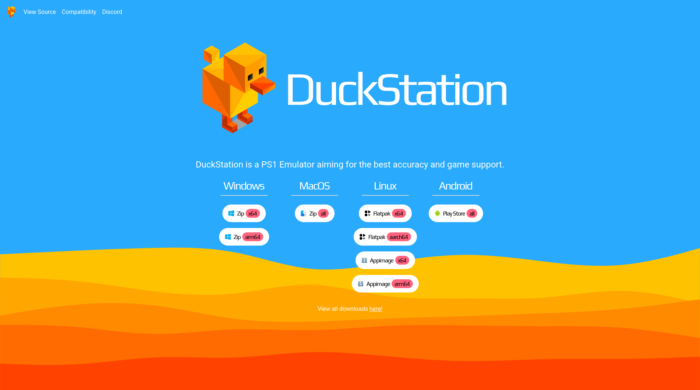

# Duckstation

This is a redesign of the [Duckstation](https://www.duckstation.org/) website. I liked the colorscheme of the original DuckStation website, but I felt that there were a couple of problems with it.

## Organization
There was not a lot of content on the original site, but the website still had multiple pages. I felt that this wasn't necessary, and it would  be nicer to have all the downloads on the main page, where people wouldn't have to click through.

## Components
Here's a description on how I redesigned components from the original site

### Header
#### Original Header

This is the original header, I like the way it looks, however, it seems like a mish-mash of components.
- First off, the home button does not provide any user feedback when hovered or pressed, only a cursor change to pointer.  It also does not contain an icon, which the rest of the buttons do.
- The Download button when hovered, changes the text color to black, which is fine, however, none of the other button in the header follow this behavior. It does have an icon, but it is on the right side of the text, and not the left like the language selector is.

#### New Header

Here is the new header I created. I decided to have it fill the whle width of the page not for any particular reason, I just felt that it looked nicer. I made all of the links on the left side of the header have an underline when hovered, to give a sense of feedback.

#### Original Language Dropdown

This is the old language selector when it is extended. While it is functional, it does not keep continuity with the download button in the header due to its icon being on the left side.

The options in the dropdown are what I can assume are locales for the languages, but instead of being the locales, they should be the full languages names of English and 日本語　(Japanese).

#### New Language Dropdown

On the right side of the header, I added the language switcher. It's not that much different, but I felt that it was nicer to include the full languages as well as making it stand out agains the background for better legebility.
### Hero

#### Original Hero 

Here is the original hero, it's not bad, but it could use a little more styling.

#### New Hero 

I first used a PlayStation inspired font to make the hero seem more unique. I also moved the buttons for the downloads into a seperate container beneath the hero as a part of my simplification process.

### Downloads

#### Old Downloads

This it the old download section. I give it props for following the same button design as the language selector button, however, I felt that having the windows downlad redirect you to another page rather than just downloading the zip seemed redundant. Also, having the other platfofrms take you to the github project instead of just providing the links to users seemed to be user-adverse, as it's throwing the users into the deep end.

#### New Downloads

Here, I decided to consolidate all the downloads into one place, for each platform. I also added some information inside the buttons for different CPU architectures.

I made all of the buttons white to give it a better contrast from the background, and I added a pinkish color for the architectures, and I added colored logos for easier visual identification.

Thanks for Reading!